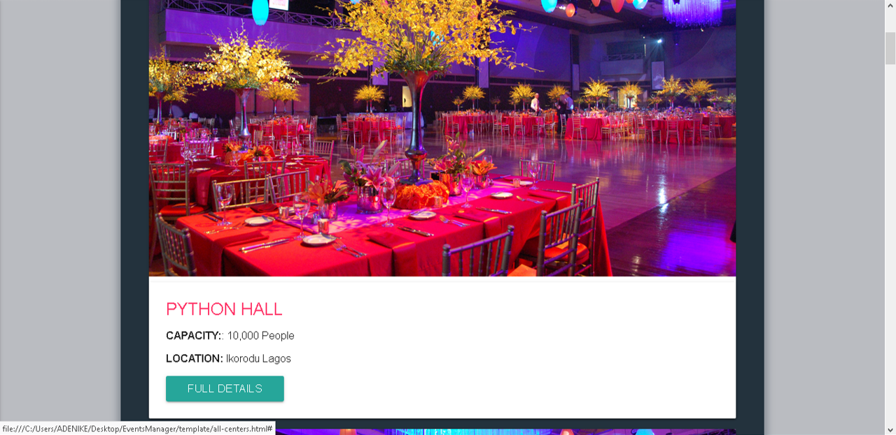
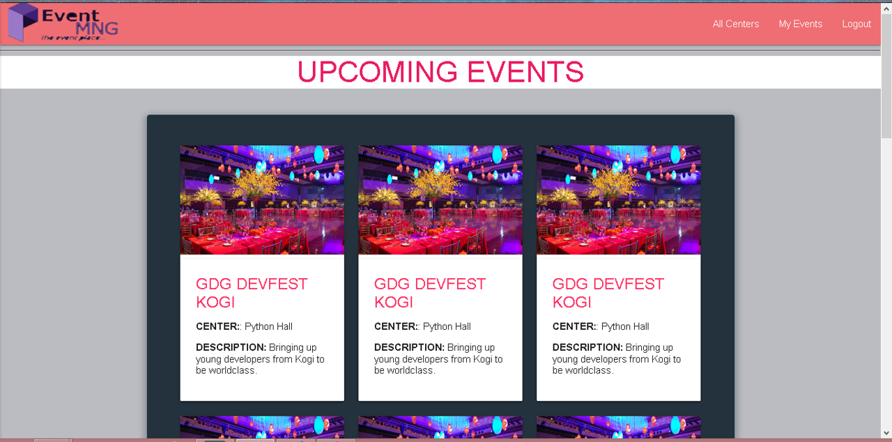

# EVENTSMANAGER
<h1>EventsManager is a FullStack JavaSript Web App built for Management and organisation of events and event centers.</h1>

# Technologies in use:
<ol>
    <li>React-Redux</li>
    <li>NodeJS</li>
    <li>ExpressJs</li>
</ol>

# EventsManager User Story
<ol>
    <li>Users can Sign up / Sign in</li>
    <li>Users can Create Events</li>
    <li>Users can Modify their Events</li>
    <li>Users can View All Available centers and upcoming events for each center</li>
    <li>Users can Delete Events</li>
</ol>

# EventsManager Admin Story
<ol>
    <li>Admin Can Create Event Centers</li>
    <li>Admin Can Modify and Delete Event CenterS</li>
    <li>Admin Can Delete Events</li>
</ol>

# Screenshots of EventsManager Template:

# Demo
view a demo of this template here ; <a href="https://leksyib.github.io/EventsManager/Template">DEMO!</a>